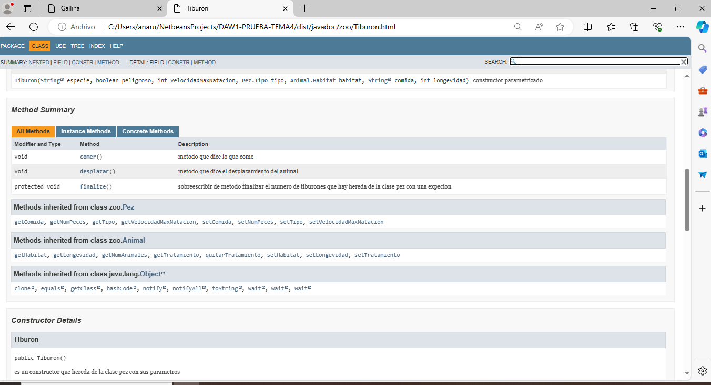

# PRUEBA DE TEMA4 ENTORNOS DE DESARROLLO  Y CONTROL DE VERSIONES
**DOCUMENTACION ,OPTIMAZION Y CONTROL DE VERSION**
***ANA RUANO RUIZ***

## EJERCICIO 1

## EJERCICIO 2

## EJERCICIO 3

## EJERCICIO 4

## EJERCICIO 5

## EJERCICIO 6

## EJERCICIO 7

